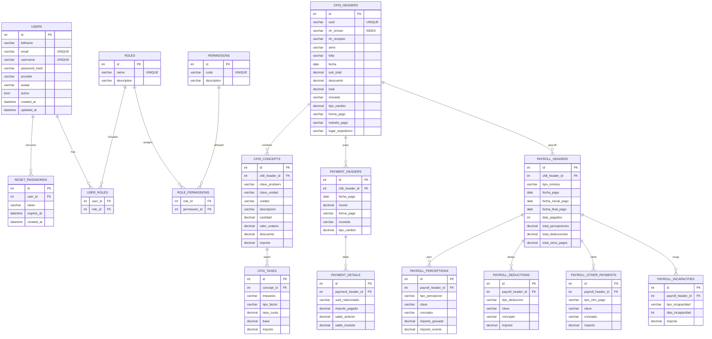

```mermaid
erDiagram
    %% ——— SEGURIDAD / AUTH ———
    USERS {
        int id PK
        varchar fullname
        varchar email "UNIQUE"
        varchar username "UNIQUE"
        varchar password_hash
        varchar provider
        varchar avatar
        bool   activo
        datetime created_at
        datetime updated_at
    }
    RESET_PASSWORDS {
        int id PK
        int user_id FK
        varchar token
        datetime expires_at
        datetime created_at
    }
    ROLES {
        int id PK
        varchar name  "UNIQUE"
        varchar description
    }
    PERMISSIONS {
        int id PK
        varchar code "UNIQUE"
        varchar description
    }
    USER_ROLES {
        int user_id FK
        int role_id FK
    }
    ROLE_PERMISSIONS {
        int role_id FK
        int permission_id FK
    }

    %% ——— FACTURACIÓN CFDI ———
    CFDI_HEADERS {
        int id PK
        varchar uuid        "UNIQUE"
        varchar rfc_emisor  "INDEX"
        varchar rfc_receptor
        varchar serie
        varchar folio
        date    fecha
        decimal sub_total
        decimal descuento
        decimal total
        varchar moneda
        decimal tipo_cambio
        varchar forma_pago
        varchar metodo_pago
        varchar lugar_expedicion
    }
    CFDI_CONCEPTS {
        int id PK
        int cfdi_header_id FK
        varchar clave_prodserv
        varchar clave_unidad
        varchar unidad
        varchar descripcion
        decimal cantidad
        decimal valor_unitario
        decimal descuento
        decimal importe
    }
    CFDI_TAXES {
        int id PK
        int concept_id FK
        varchar impuesto
        varchar tipo_factor
        decimal tasa_cuota
        decimal base
        decimal importe
    }

    %% ——— COMPLEMENTO DE PAGOS ———
    PAYMENT_HEADERS {
        int id PK
        int cfdi_header_id FK
        date fecha_pago
        decimal monto
        varchar forma_pago
        varchar moneda
        decimal tipo_cambio
    }
    PAYMENT_DETAILS {
        int id PK
        int payment_header_id FK
        varchar uuid_relacionado
        decimal importe_pagado
        decimal saldo_anterior
        decimal saldo_insoluto
    }

    %% ——— COMPLEMENTO DE NÓMINA ———
    PAYROLL_HEADERS {
        int id PK
        int cfdi_header_id FK
        varchar tipo_nomina
        date fecha_pago
        date fecha_inicial_pago
        date fecha_final_pago
        int  dias_pagados
        decimal total_percepciones
        decimal total_deducciones
        decimal total_otros_pagos
    }
    PAYROLL_PERCEPTIONS {
        int id PK
        int payroll_header_id FK
        varchar tipo_percepcion
        varchar clave
        varchar concepto
        decimal importe_gravado
        decimal importe_exento
    }
    PAYROLL_DEDUCTIONS {
        int id PK
        int payroll_header_id FK
        varchar tipo_deduccion
        varchar clave
        varchar concepto
        decimal importe
    }
    PAYROLL_OTHER_PAYMENTS {
        int id PK
        int payroll_header_id FK
        varchar tipo_otro_pago
        varchar clave
        varchar concepto
        decimal importe
    }
    PAYROLL_INCAPACITIES {
        int id PK
        int payroll_header_id FK
        varchar tipo_incapacidad
        int dias_incapacidad
        decimal importe
    }

    %% ——— RELACIONES ———
    USERS           ||--o{ USER_ROLES            : has
    ROLES           ||--o{ USER_ROLES            : includes
    ROLES           ||--o{ ROLE_PERMISSIONS      : assigns
    PERMISSIONS     ||--o{ ROLE_PERMISSIONS      : allowed
    USERS           ||--o{ RESET_PASSWORDS       : recovers
    CFDI_HEADERS    ||--o{ CFDI_CONCEPTS         : contains
    CFDI_CONCEPTS   ||--o{ CFDI_TAXES            : taxed
    CFDI_HEADERS    ||--o{ PAYMENT_HEADERS       : pays
    PAYMENT_HEADERS ||--o{ PAYMENT_DETAILS       : detal
    CFDI_HEADERS    ||--o{ PAYROLL_HEADERS       : payroll
    PAYROLL_HEADERS ||--o{ PAYROLL_PERCEPTIONS   : perc
    PAYROLL_HEADERS ||--o{ PAYROLL_DEDUCTIONS    : deduc
    PAYROLL_HEADERS ||--o{ PAYROLL_OTHER_PAYMENTS: other
    PAYROLL_HEADERS ||--o{ PAYROLL_INCAPACITIES  : incap
```