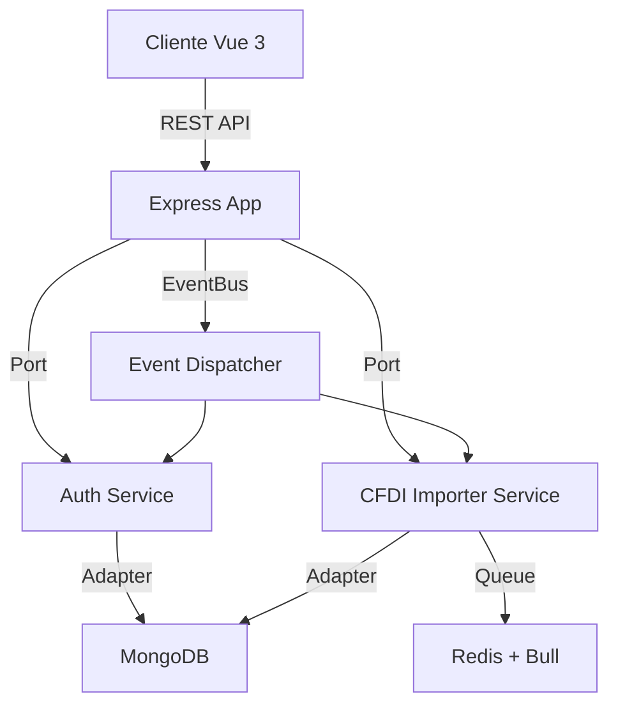

## Arquitectura

```mermaid
graph TD
    A[Cliente Vue 3] -->|REST API| B[Express App]
    B -->|Port| C1[Auth Service]
    B -->|Port| C2[CFDI Importer Service]
    C1 -->|Adapter| D1[MongoDB]
    C2 -->|Adapter| D1
    B -->|EventBus| E[Event Dispatcher]
    E --> C1
    E --> C2
    C2 -->|Queue| F[Redis + Bull]
```